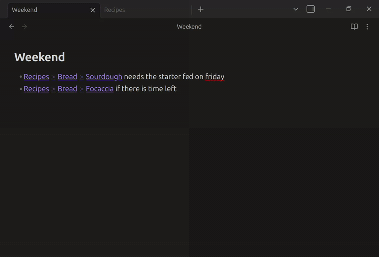
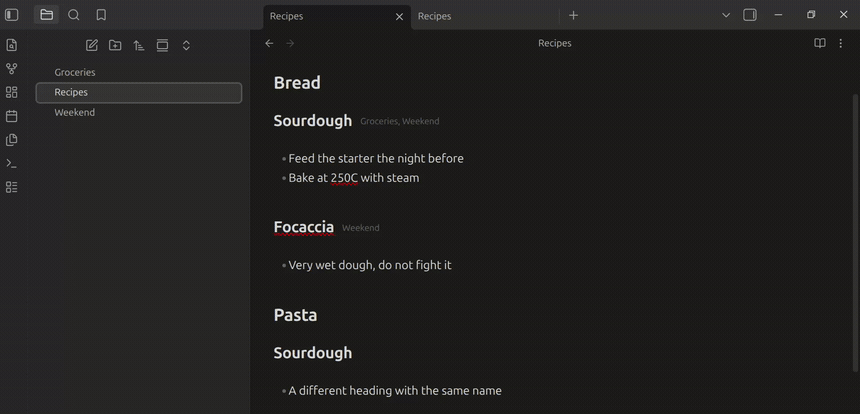

# Heading Links

Two small things for links that point at a heading, both in Live Preview.

## Breadcrumbs while editing

`[[Recipes#Bread#Sourdough]]` reads as `Recipes > Bread > Sourdough`.

Obsidian already does this in Reading view, but in Live Preview the link stays raw. Put the cursor on it and the raw text comes back, the same as any other link. Click to open, ctrl or middle click to open in a tab.

Nested anchors work: every `#` becomes a step.

## Which notes link to a heading

At the end of a heading line, the names of the notes that link to it.

Click a name to open it, ctrl+hover to preview. A note linking to its own heading is not listed, since that tells you nothing.

<!--  -->

## Install

Not in the community store. Copy `main.js`, `manifest.json` and `styles.css` into `<vault>/.obsidian/plugins/heading-links/`, or point [BRAT](https://github.com/TfTHacker/obsidian42-brat) at this repo.

## Settings

Each of the two can be turned off on its own. Breadcrumbs can also be applied to `![[Note#Heading]]` embeds, which is off by default.

## Tests

`node test/test.js` checks the parsing: nested anchors, heading matching, and which note ends up credited under which heading. No Obsidian needed, the API is stubbed.
